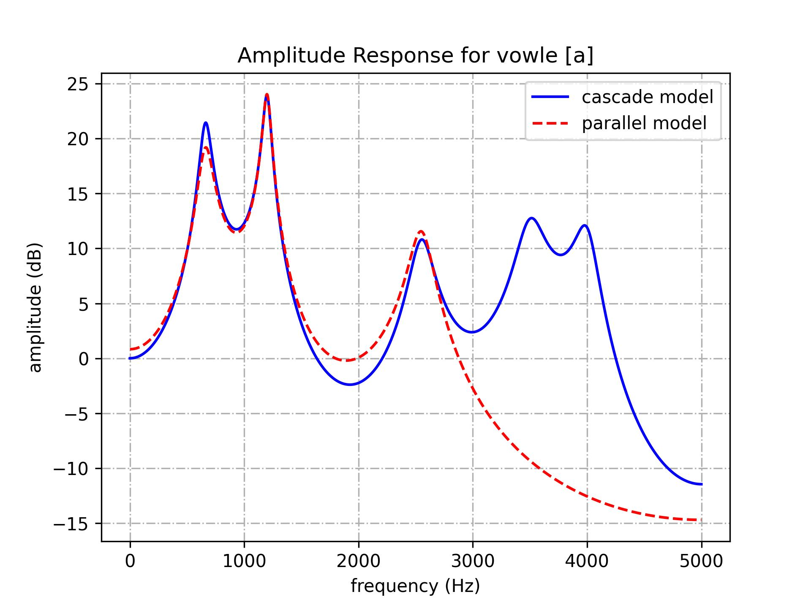
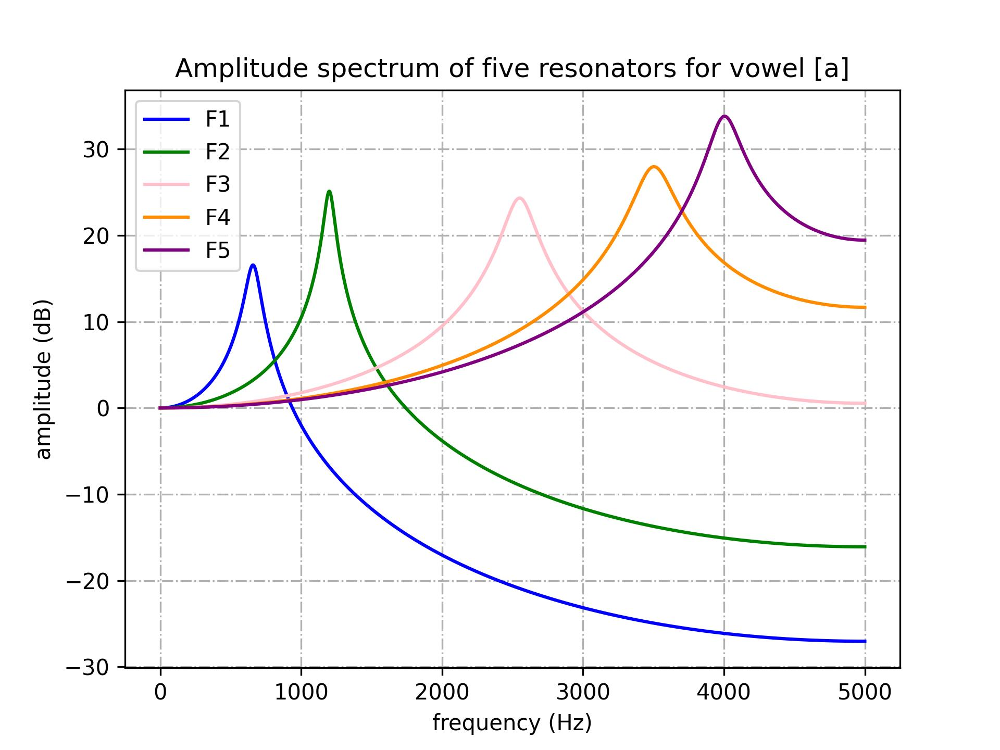
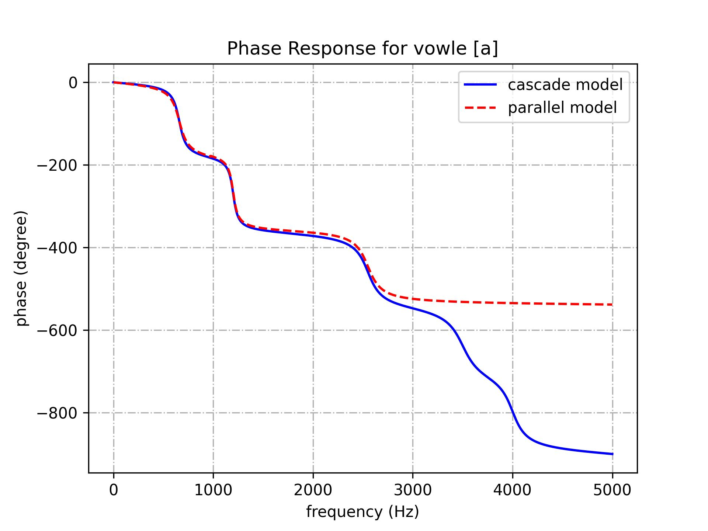
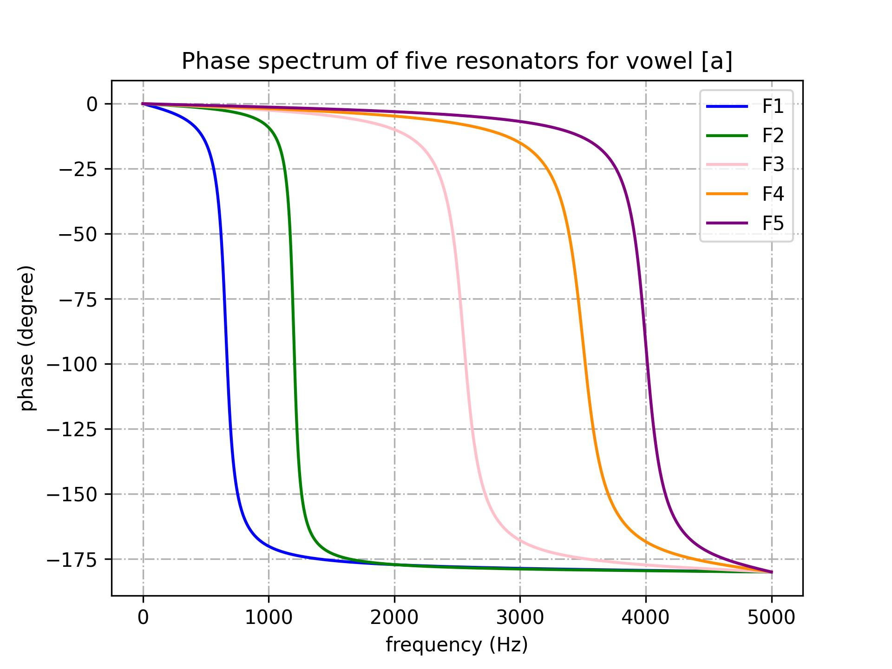
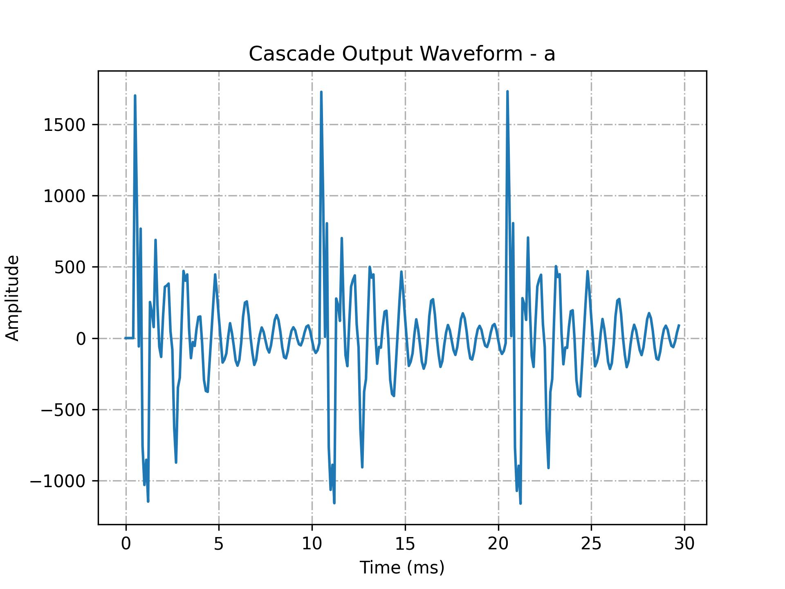
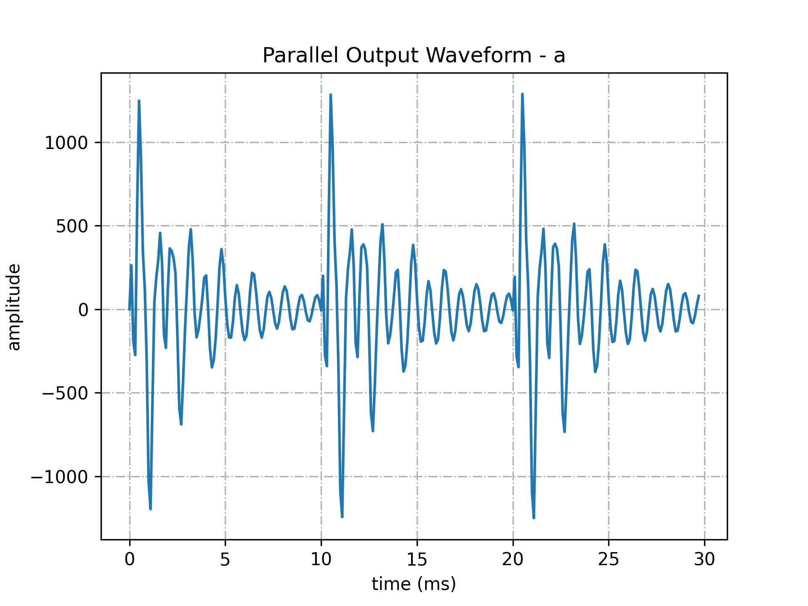
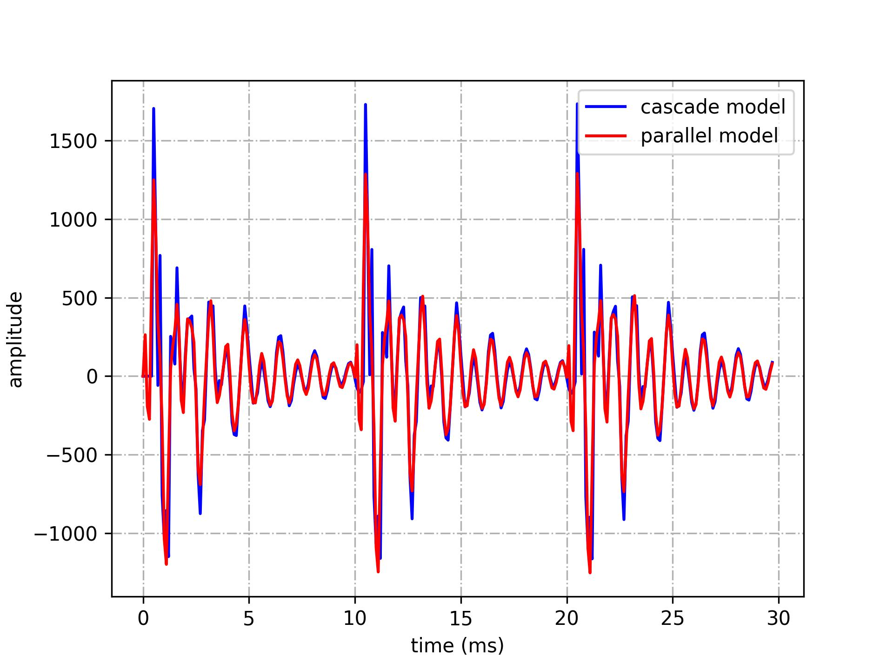

# Cascade-and-parallel-formant-synthesis

Install the the dependencies in the **requirements.txt** to make sure the project run correctly.

# Graphs of vowel [a]

amplitude_respons_a | formant_amplitude_a
--- | ---
 | 

phase_response_a| formant_Phase_a
--- | ---
 | 

cascade_waveform_a | parallel_waveform_a | Output_wavefor_a
--- | --- | ---
 |  | 
